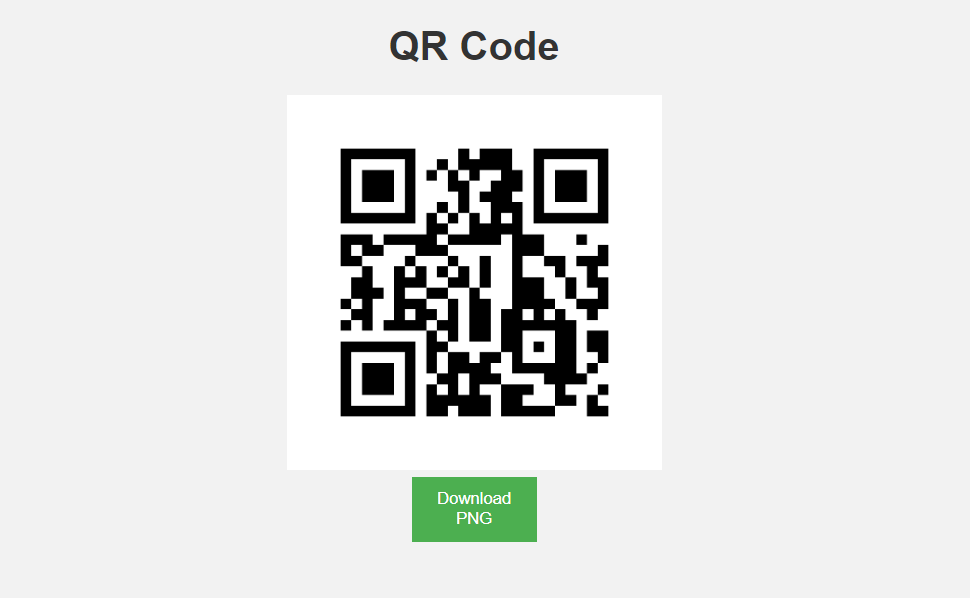

# 🖥️ | Gerador de QR code!

Este é um gerador de QR code por meio de uma url ou frases, também permitindo o download gratuito para o usuário.

Acesse: https://qrcode-rapido.vercel.app/

## 🔧 Intalação:
1. Clone este repositório com `git clone` ou baixe o código-fonte.
2. Instalação de Python, caso não estiver previamente instalada em seu computador
3. Instale as dependências, caso houver: `pip install flask`

## 🚀 Execução:
Apenas clicar em 'run' e abrir no endereço http://127.0.0.1:5000/

## 📊 Tecnologias e ferramentas:
- HTML
- CSS
- Python
- Flask
- Segno

## 📩 Dúvidas:

Qualquer dúvida, pode enviar um email para: [Miguel Rossi Fermo](mailto:miguelrossifermo05@gmail.com)

## 🖥️ Demonstração do projeto:

